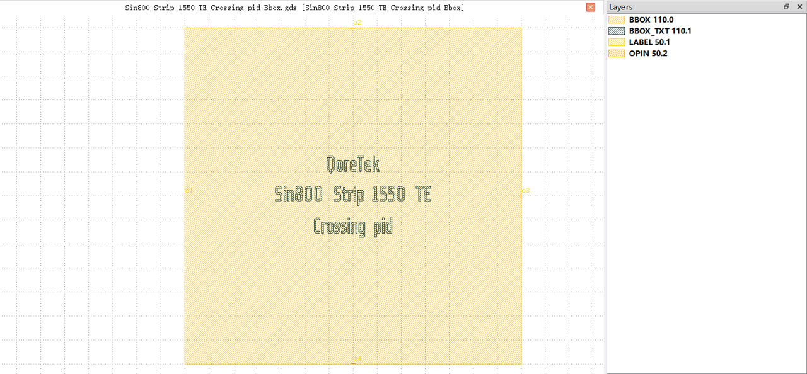
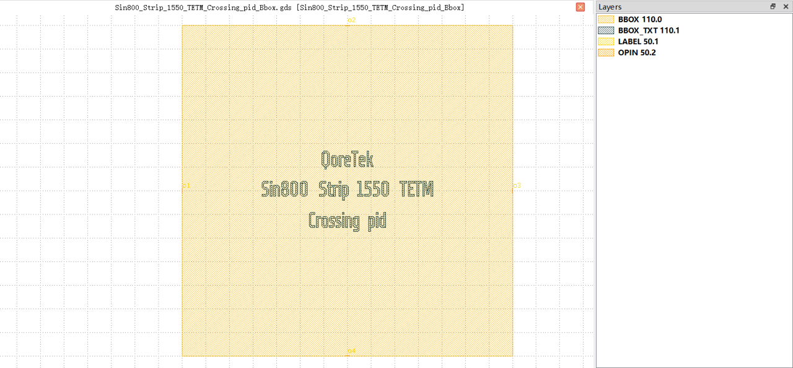

Crossing
#############################

Sin800_Strip_1550_TE_Crossing_pid_Bbox
**********************************************************

+-------------------+-----------------------------+------------------------+-------------+
|     ports         | waveguide type              | position               | orientation |
+===================+=============================+========================+=============+
| o1                | TECH.WG.STRIP.C.WIRE        | (0, 0)                 | 180         |
+-------------------+-----------------------------+------------------------+-------------+
| o2                | TECH.WG.STRIP.C.WIRE        | (35, 35)               | 90          |
+-------------------+-----------------------------+------------------------+-------------+
| o3                | TECH.WG.STRIP.C.WIRE        | (70, 0)                | 0           |
+-------------------+-----------------------------+------------------------+-------------+
| o4                | TECH.WG.STRIP.C.WIRE        | (35, -35)              | 270         |
+-------------------+-----------------------------+------------------------+-------------+

Sin800_Strip_1550_TETM_Crossing_pid_Bbox
**********************************************************

+-------------------+-----------------------------+------------------------+-------------+
|     ports         | waveguide type              | position               | orientation |
+===================+=============================+========================+=============+
| o1                | TECH.WG.STRIP.C.WIRE        | (0, 0)                 | 180         |
+-------------------+-----------------------------+------------------------+-------------+
| o2                | TECH.WG.STRIP.C.WIRE        | (35, 35)               | 90          |
+-------------------+-----------------------------+------------------------+-------------+
| o3                | TECH.WG.STRIP.C.WIRE        | (70, 0)                | 0           |
+-------------------+-----------------------------+------------------------+-------------+
| o4                | TECH.WG.STRIP.C.WIRE        | (35, -35)              | 270         |
+-------------------+-----------------------------+------------------------+-------------+
