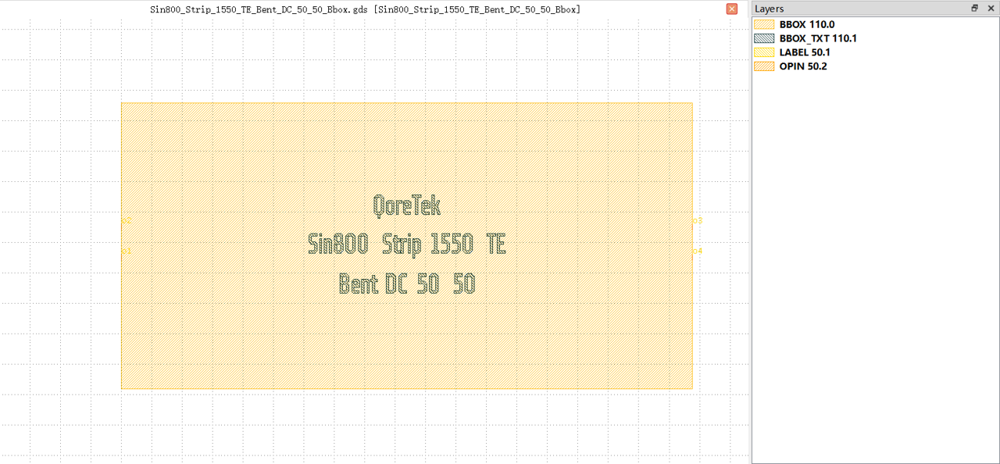
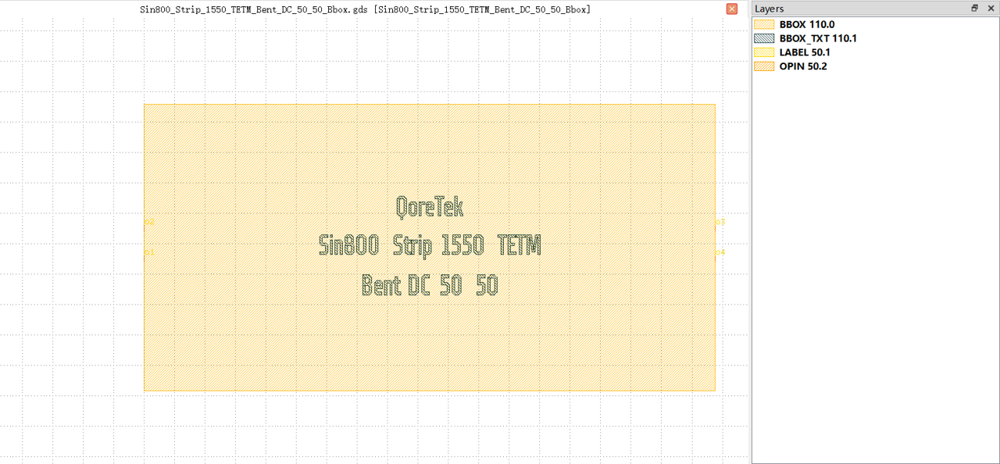

Bent DC
#############################

Sin800_Strip_1550_TE_Bent_DC_50_50_Bbox
**********************************************************

+-------------------+-----------------------------+------------------------+-------------+
|     ports         | waveguide type              | position               | orientation |
+===================+=============================+========================+=============+
| o1                | TECH.WG.STRIP.C.WIRE        | (0.0, -2.532)          | 180         |
+-------------------+-----------------------------+------------------------+-------------+
| o2                | TECH.WG.STRIP.C.WIRE        | (0.0, 2.532)           | 180         |
+-------------------+-----------------------------+------------------------+-------------+
| o3                | TECH.WG.STRIP.C.WIRE        | (93.832, 2.532)        | 0           |
+-------------------+-----------------------------+------------------------+-------------+
| o4                | TECH.WG.STRIP.C.WIRE        | (93.832, -2.532)       | 0           |
+-------------------+-----------------------------+------------------------+-------------+

Sin800_Strip_1550_TETM_Bent_DC_50_50_Bbox
**********************************************************

+-------------------+-----------------------------+------------------------+-------------+
|     ports         | waveguide type              | position               | orientation |
+===================+=============================+========================+=============+
| o1                | TECH.WG.STRIP.C.WIRE        | (0.0, -2.532)          | 180         |
+-------------------+-----------------------------+------------------------+-------------+
| o2                | TECH.WG.STRIP.C.WIRE        | (0.0, 2.532)           | 180         |
+-------------------+-----------------------------+------------------------+-------------+
| o3                | TECH.WG.STRIP.C.WIRE        | (93.832, 2.532)        | 0           |
+-------------------+-----------------------------+------------------------+-------------+
| o4                | TECH.WG.STRIP.C.WIRE        | (93.832, -2.532)       | 0           |
+-------------------+-----------------------------+------------------------+-------------+
