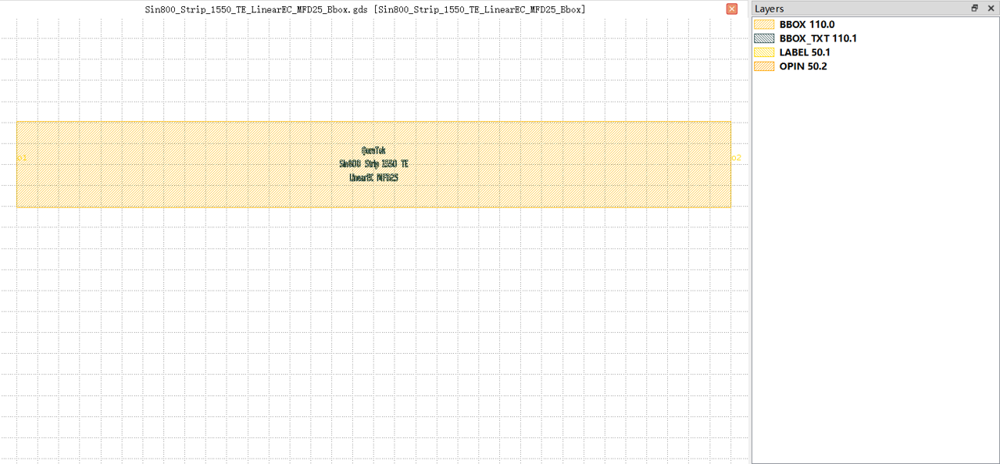
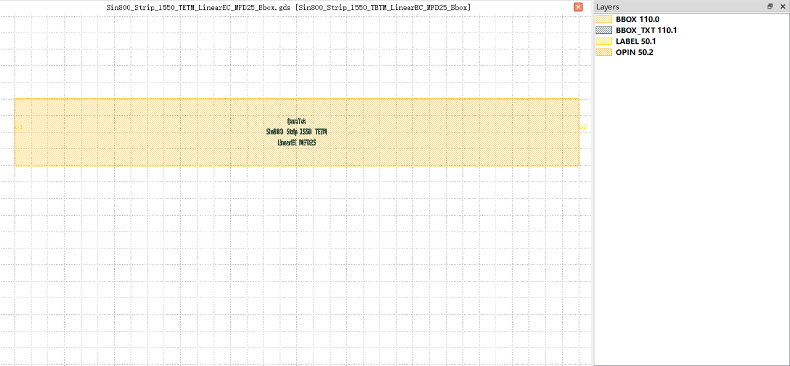

Edge Coupler
#############################

Sin800_Strip_1550_TE_LinearEC_MFD25_Bbox
**********************************************************

+-------------------+-----------------------------+---------------+-------------+
|     ports         | waveguide type              | position      | orientation |
+===================+=============================+===============+=============+
| o1                | TECH.WG.Strip.C.WIRE        | (0.0, 0.0)    | 180         |
+-------------------+-----------------------------+---------------+-------------+
| o2                | TECH.WG.Strip.C.WIRE        | (340.0, 0.0)  | 0           |
+-------------------+-----------------------------+---------------+-------------+

Sin800_Strip_1550_TETM_LinearEC_MFD25_Bbox
**********************************************************

+-------------------+-----------------------------+---------------+-------------+
|     ports         | waveguide type              | position      | orientation |
+===================+=============================+===============+=============+
| o1                | TECH.WG.Strip.C.WIRE        | (0.0, 0.0)    | 180         |
+-------------------+-----------------------------+---------------+-------------+
| o2                | TECH.WG.Strip.C.WIRE        | (340.0, 0.0)  | 0           |
+-------------------+-----------------------------+---------------+-------------+