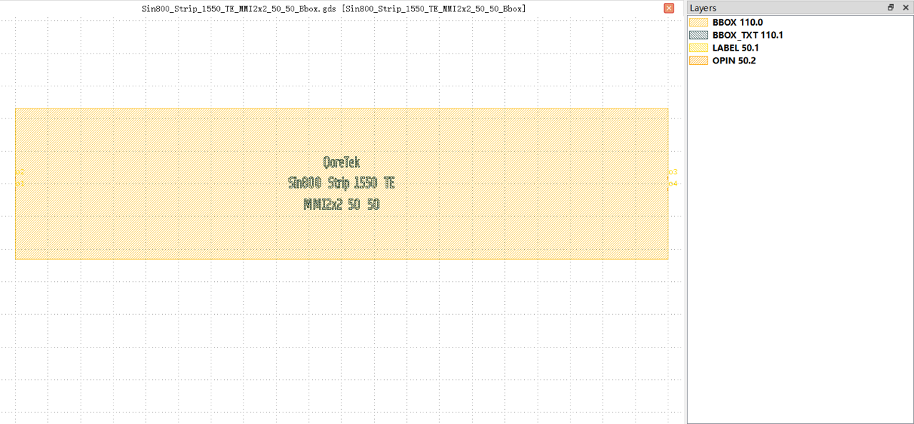
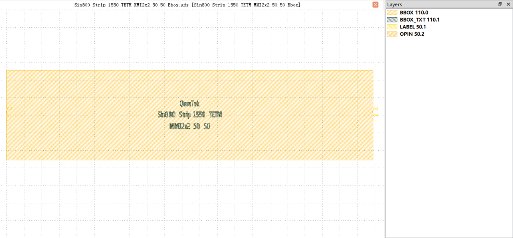

2x2 MMI
##########################################################

Sin800_Strip_1550_TE_MMI2x2_50_50_Bbox
**********************************************************

+-------------------+-----------------------------+------------------------+-------------+
|     ports         | waveguide type              | position               | orientation |
+===================+=============================+========================+=============+
| o1                | TECH.WG.STRIP.C.WIRE        | (0.0, -1.75)           | 180         |
+-------------------+-----------------------------+------------------------+-------------+
| o2                | TECH.WG.STRIP.C.WIRE        | (0.0, 1.75)            | 180         |
+-------------------+-----------------------------+------------------------+-------------+
| o3                | TECH.WG.STRIP.C.WIRE        | (199.96, 1.75)         | 0           |
+-------------------+-----------------------------+------------------------+-------------+
| o4                | TECH.WG.STRIP.C.WIRE        | (199.96, -1.75)        | 0           |
+-------------------+-----------------------------+------------------------+-------------+

Sin800_Strip_1550_TETM_MMI2x2_50_50_Bbox
**********************************************************

+-------------------+-----------------------------+------------------------+-------------+
|     ports         | waveguide type              | position               | orientation |
+===================+=============================+========================+=============+
| o1                | TECH.WG.STRIP.C.WIRE        | (0.0, -1.896)          | 180         |
+-------------------+-----------------------------+------------------------+-------------+
| o2                | TECH.WG.STRIP.C.WIRE        | (0.0, 1.896)           | 180         |
+-------------------+-----------------------------+------------------------+-------------+
| o3                | TECH.WG.STRIP.C.WIRE        | (208.77, 1.896)        | 0           |
+-------------------+-----------------------------+------------------------+-------------+
| o4                | TECH.WG.STRIP.C.WIRE        | (208.77, -1.896)       | 0           |
+-------------------+-----------------------------+------------------------+-------------+
