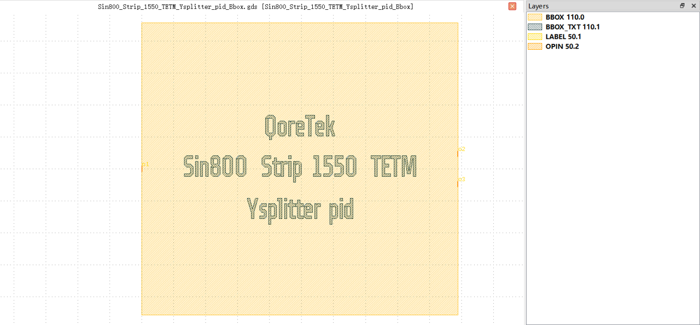

Y Splitter
##########################################################

Sin800_Strip_1550_TETM_Ysplitter_pid_Bbox
**********************************************************

+-------------------+-----------------------------+------------------------+-------------+
|     ports         | waveguide type              | position               | orientation |
+===================+=============================+========================+=============+
| o1                | TECH.WG.STRIP.C.WIRE        | (0, 0)                 | 180         |
+-------------------+-----------------------------+------------------------+-------------+
| o2                | TECH.WG.STRIP.C.WIRE        | (49.48, 2.363)         | 0           |
+-------------------+-----------------------------+------------------------+-------------+
| o3                | TECH.WG.STRIP.C.WIRE        | (49.48, -2.363)        | 0           |
+-------------------+-----------------------------+------------------------+-------------+
