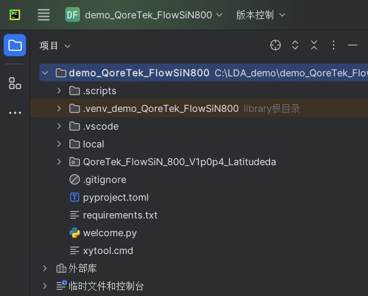

Install PhotoCAD and QoreTek FlowSiN 800 V1p0p4 PDK
=======================================

Once Python and Pycharm are installed, you can follow the instructions to install **PhotoCAD** via **PIC Studio**. After installation, we will find the completed **fnpcell** and **gpdk** packages in ``Lib>site-packages``. **fnpcell** is the main package of **PhotoCAD**, which is used for parametric layout component scripts and layout routing scripts. **gpdk** is a collection of all examples in **PhotoCAD**. It contains both component cell layout scripts and other design templates based on parametric component cells.

To install **QoreTek FlowSiN 800 V1p0p4 PDK** package to **PhotoCAD**, extract ``QoreTek_FlowSiN_800_V1p0p4_Latitudeda_Customer.zip`` to the project folder.

